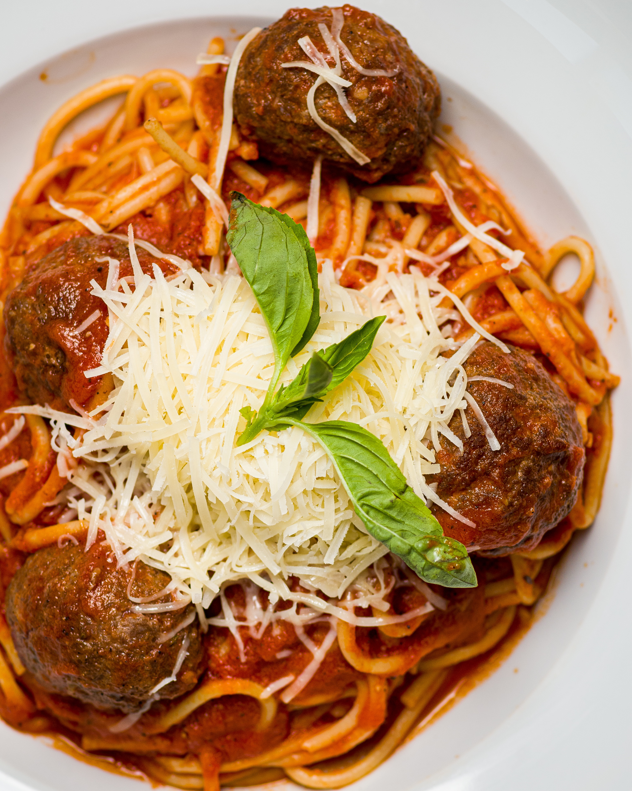

intro for spaghetti and meatballs 

## **Ingredients:**

* 1 pound ground beef 
* ¼ cup fresh minced onion
* 2 tablespoons of dry bread crumbs 
* ¼ teaspoon garlic salt
* ¼ teaspoon pepper
* 1 large egg white, lightly beaten
* 1 (25.5-ounce) jar fat-free tomato-and-basil pasta sauce, divided
* Cooking spray
* 5 portions of hot cooked spaghetti (about 8 ounces uncooked pasta)
* 5 tablespoons grated Parmesan cheese
* 5 tablespoons chopped fresh basil

## Method:

1. Combine the first 6 ingredients and 2 tablespoons of pasta sauce in a medium bowl
2. Shape the meat mixture into 25 (1-inch) meatballs.
3. Place a large nonstick skillet coated with cooking spray over medium heat until hot.
4. Add the meatballs, and cook for 6 minutes, browning on all sides. 
5. Stir in remaining pasta sauce. 
6. Cover, reduce heat, and simmer for 10 minutes or until the meatballs are done, stirring occasionally.
7. Serve the meatballs over spaghetti, and sprinkle with Parmesan cheese and fresh basil.