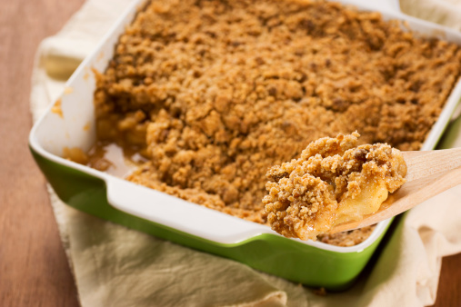

intro for apple crumble

## Ingredients:

##### For the filling:

* 575g Bramley apple (3 medium apples), peeled, cored and sliced to 1cm thick
* 2 tbsp golden caster sugar

##### For the crumble:

* 175g plain flour
* 110g golden caster sugar
* 110g cold butter

##### For the topping (optional):

* 1 tbsp rolled oats
* 1 tbsp demerara sugar
* double cream, clotted cream or custard, to serve

## Method:

1.Heat the oven to 190C/170 fan/gas 5.

2. Toss 575g peeled, cored and sliced Bramley apples with 2 tbsp golden caster sugar and put in a 23cm round baking dish at least 5cm deep, or a 20cm square dish. Flatten down with your hand to prevent too much crumble falling through.
3. Put 175g plain flour and 110g golden caster sugar in a [bowl](https://www.bbcgoodfood.com/content/top-five-mixing-bowls) with a good pinch of salt.
4. Slice in 110g cold butter and rub it in with your fingertips until the mixture looks like moist breadcrumbs. Shake the bowl and any big bits will come to the surface – rub them in. Alternatively, pulse in a [processor](https://www.bbcgoodfood.com/content/test-five-best-food-processors) until sandy (don’t over-process).
5. Pour the crumb mix over the apples to form a pile in the centre, then use a fork to even out.
6. Gently press the surface with the back of the fork so the crumble holds together and goes crisp, then lightly drag the fork over the top for a decorative finish.
7. Sprinkle 1 tbsp rolled oats and 1 tbsp demerara sugar over evenly, if you wish.
8. Set on a baking tray and put in the preheated oven for 35-40 minutes, until the top is golden and the apples feel very soft when you insert a small, sharp knife. Leave to cool for 10 minutes before serving..