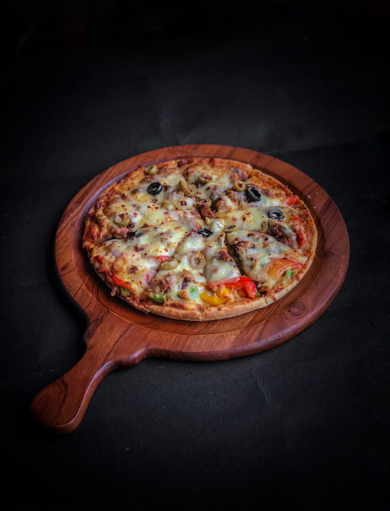
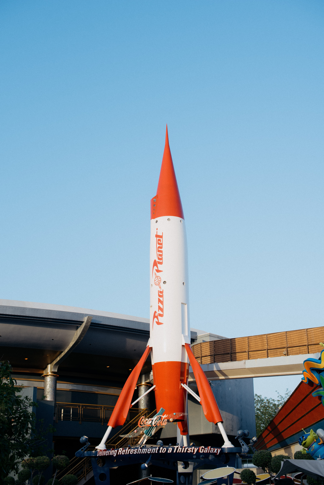

There's only one thing better than pizza, and that's homemade pizza. Customise yours with your favourite toppings and enjoy, it's really that simple! 

## **Ingredients**

* 1/2 cup warm water 
* 1/2 teaspoon sugar 
* 1 teaspoon active dry yeast 
* 1 cup all-purpose flour 
* 1 teaspoon salt 
* 2 tablespoons olive oil 
* 1/4 cup tomato sauce 
* 1/2 cup shredded mozzarella cheese 
* your favourite pizza toppings

## Method

1. In a small bowl, comine the warm water, sugar, and yeast. Let the mixture sit for 5 minutes until the yeast is foamy.
2. In a large bowl, mix together the flour and salt. Add the yeast mixture and olive oil and stir until a dough forms. 
3. Knead the dough for 3-4 minutes, then cover the bowl with a damp towel and let the dough rise for 30 minutes. 
4. Preheat the oven to 375°F. 
5. On a lightly floured surface, roll out the pizza dough to a 12-inch round. Place the dough on a lightly greased baking sheet. 
6. Spread the tomato sauce over the pizza dough, then sprinkle with cheese and any desired toppings. 
7. Bake for 15-20 minutes, or until the cheese is melted and bubbly.
8. Cut evenly into eight triangular slices and enjoy!

